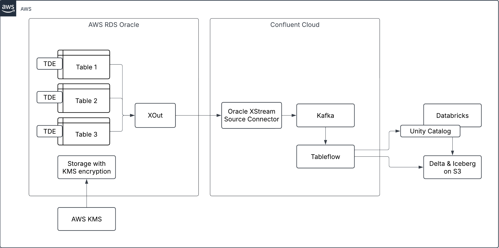

# Stream data from Amazon RDS for Oracle to Databricks using Confluent Cloud

This demo shows how to stream data from Amazon RDS for Oracle to Databricks using Confluent's Oracle XStream Source Connector on Confluent Cloud.



- From Source: [Amazon RDS for Oracle](https://docs.aws.amazon.com/AmazonRDS/latest/UserGuide/CHAP_Oracle.html)
- To Target: [Databricks](https://docs.databricks.com/aws/en/)
- Using: [Confluent Cloud](https://www.confluent.io/confluent-cloud/).

For any questions or feedback, feel free to reach out on [LinkedIn](https://www.linkedin.com/in/anlikers/).

## Setup

Devbox is used to provide a fully functional dev env. The tooling below can also be installed without devbox.

Install devbox: https://www.jetify.com/docs/devbox/installing-devbox

Devbox is used to provide:
- Python and creates a virtual env.
- Pulumi without additional binaries
- Pulumi python language SDK
- AWS CLI v2

Check if devbox is installed.

```sh
devbox version
```

Run devbox shell to enter the dev env.

```sh
devbox shell
```

If you see the versions of python, pip and pulumi listed in your console, followed by `Done.` - you're all set.


Tested on
- Ubuntu-22.04 on WSL2 (6.6.87.2-microsoft-standard-WSL2)


## Run

If you have done the setup above you should now have a devbox shell open.

Navigate to the `infra` directory
```sh
cd infra
```

Install python packages
```sh
pip install -r requirements.txt
```

Create local pulumi state (do not use this in production!). Pulumi will now store all it's state in `infra/.pulumi`.
```sh
pulumi login file:.
```

Create a stack (called `dev` in this case). You will be asked to enter a passphrase that will be used to protect secrets.
```sh
pulumi stack init dev
```

If you don't want to enter the passphrase on every execution, create a file `pass.local` and paste your passphrase into it. Or run:
```sh
echo 'mypassphrase' > pass.local
```

Then set the env variable to point pulumi to your passphrase file
```sh
export PULUMI_CONFIG_PASSPHRASE_FILE="pass.local"
```

Allow the execution of sh files in scripts/
```sh
chmod +x scripts/*
```


Next, follow the prerequisites for the aws cli v2 IAM: https://docs.aws.amazon.com/cli/latest/userguide/getting-started-prereqs.html#getting-started-prereqs-iam

Configure the AWS cli locally
```sh
aws configure
```

If you don't have a Confluent Cloud account, create one at https://www.confluent.io/get-started/ or follow https://docs.confluent.io/cloud/current/get-started/index.html

> Note: For production deployments you would preferrably use OAuth instead of the API keys / tokens.

Create an API Key for Cloud resource management (see https://docs.confluent.io/cloud/current/security/authenticate/workload-identities/service-accounts/api-keys/manage-api-keys.html#add-an-api-key)

Setup Confluent Cloud API key
```sh
export CONFLUENT_CLOUD_API_KEY=xxxxx
export CONFLUENT_CLOUD_API_SECRET=yyyyyy
```

Create an access token for Databricks (see https://docs.databricks.com/aws/en/dev-tools/auth/pat?language=Environment#create-personal-access-tokens-for-workspace-users)

Setup Databricks host and token
```sh
export DATABRICKS_HOST=xxxxx
export DATABRICKS_TOKEN=yyyyyy
```

Run pulumi. The first one will create resources in AWS, including RDS Oracle.
```sh
pulumi up
```

Configure RDS Oracle by logging in the database and executing the statments in `sql/schema.sql` followed by `sql/xstream_setup.sql` (e.g. using SQL Developer from Oracle). The RDS endpoint is provided by the pulumi output (run `pulumi stack` to see the output) or can be copied from the AWS console. The password for the admin user is stored in the AWS Secrets Manager.

The setup in this demo has been tested. If you are running into issues or using a different database then the one provisioned by this demo, use the readiness script here: https://docs.confluent.io/kafka-connectors/oracle-cdc/current/prereqs-validation.html#validate-start-up-configuration-and-prerequisite-completion

After configuring RDS, run pulumi again. The second run will set up Confluent Cloud and Databricks.
```sh
pulumi up
```

The setup will fail to create the Databricks external location as it's not run using an admin accounts (issue described here https://community.databricks.com/t5/get-started-discussions/terraform-databricks-storage-credential-has-wrong-external-id/td-p/54153). For the automation to work, go to the Databricks UI, find the external id of the role used and updated `dbx:storageCredsExternalId` in `Pulumi.yaml` with it.

Once done, run pulumi again. This time the external location creation should succeed.
```sh
pulumi up
```


## Destroy

To destroy the resources created by pulumi, run:
```sh
pulumi destroy
```


## Todo

- [ ] Add databricks dashboard export json
- [ ] Automated dashboard setup in pulumi
